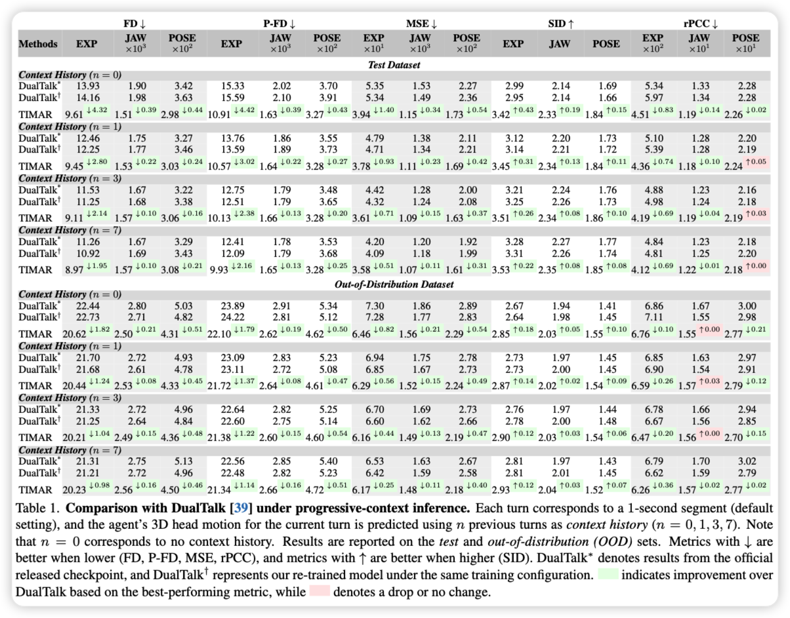
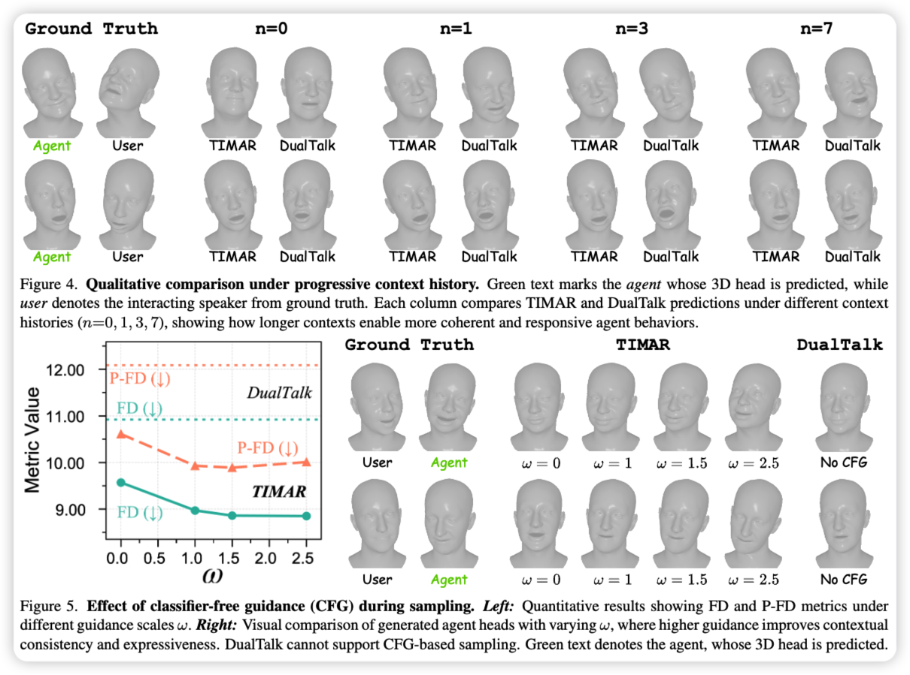
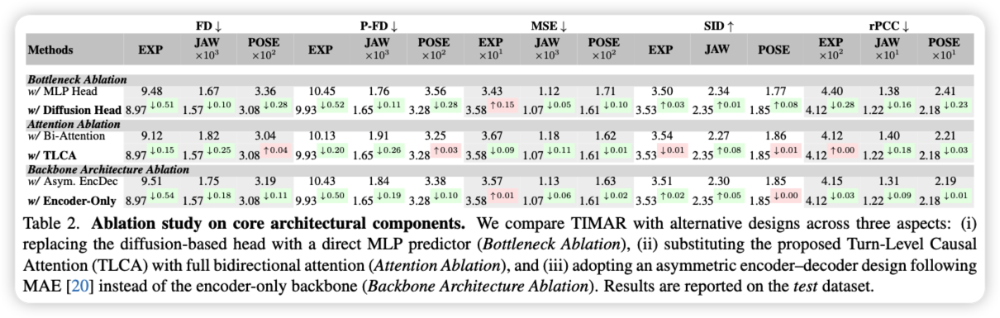
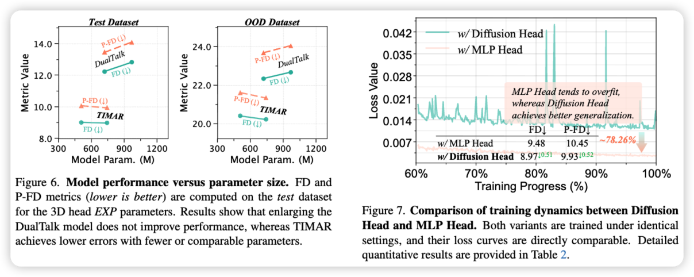

<p align="center">
  
</p>

<h1 align="center"> 🤖✨ Towards Seamless Interaction: Causal Turn-Level Modeling of Interactive 3D Conversational Head Dynamics </h1> 

<p align="center">
  <a href="./assets/paper.pdf">
    
  </a>
</p>

<p align="center">
  <strong>
    <a>Junjie Chen</a><sup>1,2</sup> ·
    <a>Fei Wang</a><sup>1,2</sup> ·
    <a>Zhihao Huang</a><sup>5,6</sup> ·
    <a>Qing Zhou</a><sup>8</sup> ·
    <a>Kun Li</a><sup>7</sup>
  </strong>
  <br/>
  <strong>
    <a target="_blank" href="https://scholar.google.com/citations?user=DsEONuMAAAAJ&hl=zh-CN">Dan Guo</a><sup>1</sup> ·
    <a target="_blank" href="https://scholar.google.com/citations?user=AK9VF30AAAAJ&hl=en&authuser=1">Linfeng Zhang</a><sup>4</sup> ·
    <a target="_blank" href="https://scholar.google.com/citations?user=ro8lzsUAAAAJ&hl=en">Xun Yang</a><sup>3</sup>
  </strong>
  <p align="center">
  <sup>1</sup> Hefei University of Technology &nbsp;&nbsp;·&nbsp;&nbsp;
  <sup>2</sup> IAI, Hefei Comprehensive National Science Center <br/>
  <sup>3</sup> USTC &nbsp;&nbsp;·&nbsp;&nbsp;
  <sup>4</sup> SJTU &nbsp;&nbsp;·&nbsp;&nbsp;
  <sup>5</sup> TeleAI, China Telecom &nbsp;&nbsp;·&nbsp;&nbsp;
  <sup>6</sup> Northwestern Polytechnical University<br/>
  <sup>7</sup> Hong Kong Baptist University &nbsp;&nbsp;·&nbsp;&nbsp;
  <sup>8</sup> Anhui Polytechnic University
  </p>
</p>

---

## 🔥 Highlights

- 🧠 **Causal turn-level formulation** for streaming conversational generation  
- 🔄 **Unified talking & listening modeling** within a single framework  
- 🎧🗣️ **Interleaved multimodal tokens** from both interlocutors  
- 🌊 **Diffusion-based 3D head decoding** for expressive and stochastic motion  
- 📉 **15–30% error reduction** over strong baselines (e.g., DualTalk)

---

## 🚀 Overview

Human conversation is a continuous exchange of **speech and nonverbal cues**—including head nods, gaze shifts, and subtle expressions.  
Most existing approaches, however, treat **talking-head** and **listening-head** generation as *separate problems*, or rely on *non-causal full-sequence modeling* that is unsuitable for real-time interaction.

We propose a **causal, turn-level framework** for interactive 3D conversational head generation.  
Our method models dialogue as a sequence of **causally linked turns**, where each turn accumulates multimodal context from both participants to produce **coherent, responsive, and humanlike 3D head dynamics**.

<p align="center">
  
</p>

---

## 🧩 Method: TIMAR

**TIMAR (Turn-level Interleaved Masked AutoRegression)** is the core method proposed in this work.

### 🧱 Key Idea

- Represent conversation as **interleaved audio–visual tokens**:
  - 👤 User speech + user head motion  
  - 🤖 Agent speech + agent head motion  
- Perform:
  - 🔁 **Bidirectional fusion within each turn** (intra-turn alignment)  
  - ⏱️ **Strictly causal reasoning across turns** (inter-turn dependency)

This design mirrors how humans coordinate speaking and listening over time.

### ⚙️ Architecture

<p align="center">
  
</p>

**Core components:**
- 🧠 **Turn-Level Causal Attention (TLCA)**  
  - Bidirectional attention inside a turn  
  - Causal masking across turns (no future leakage)  
- 🌊 **Lightweight Diffusion Head**  
  - Predicts continuous 3D head motion  
  - Captures expressive stochasticity beyond deterministic regression  

---

## 🧪 Experiments

We evaluate our framework on the **interactive 3D conversational head benchmark**, following the DualTalk protocol.

### 📊 Quantitative Results

<details>
<summary>Click to see the results</summary>
<p align="center">
  
</p>
</details>

<br/>

**Results at a glance:**
- ⬇️ **15–30% reduction** in Frechet Distance (FD) and MSE  
- 📈 Improved expressiveness and synchronization (SID ↑)  
- 🌍 Strong generalization on **out-of-distribution conversations**

---

### 🎭 Qualitative Results

<details>
<summary>Click to see the results</summary>
<p align="center">
  
</p><br/>
</details>

<br/>

TIMAR produces:
- Natural listening behavior when the agent is silent  
- Context-aware reactions with longer conversational history  
- Smoother and more stable 3D head motion  

---

### 🧩 Ablation Studies

<details>
<summary>Click to see the results</summary>
<p align="center">
  
  
</p>
</details>

<br/>

We analyze the contribution of each design choice:
- ❌ MLP head vs 🌊 diffusion-based head  
- ❌ Full bidirectional attention vs ✅ turn-level causal attention  
- ❌ Encoder–decoder vs ✅ encoder-only backbone  

Each component is critical for causal coherence and generalization.

---

## 📦 Code Release

🚧 **Code will be released soon!**  

The full implementation of **TIMAR**, including training and inference pipelines, will be publicly released.  
If you are interested, feel free to ⭐️ this repository and check back later.

---

## 📚 Citation

If you find this work useful, please consider citing:

```bibtex
To be updated